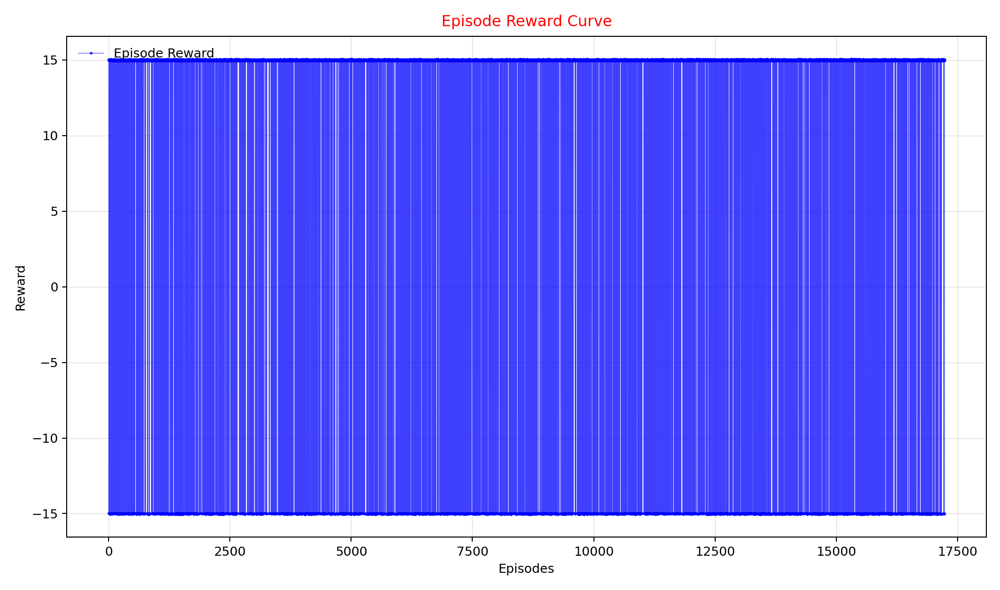
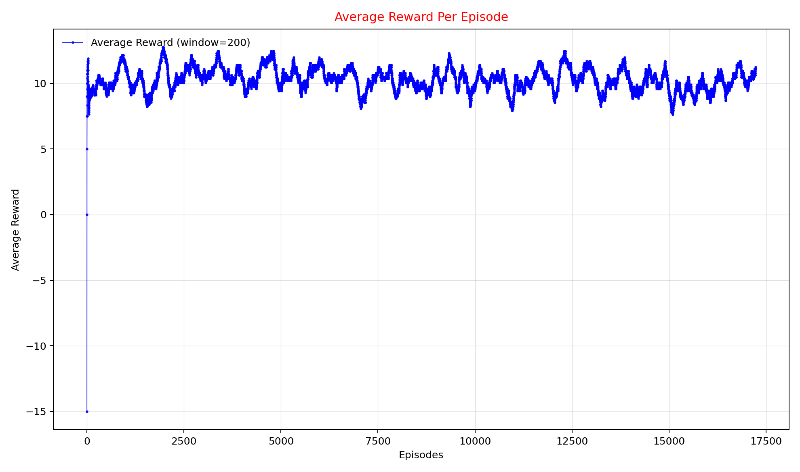
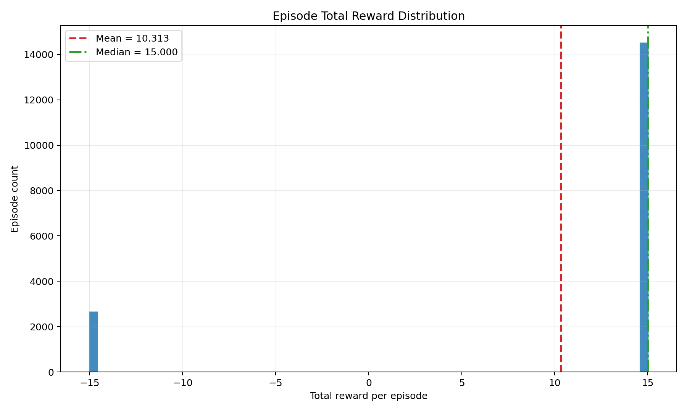
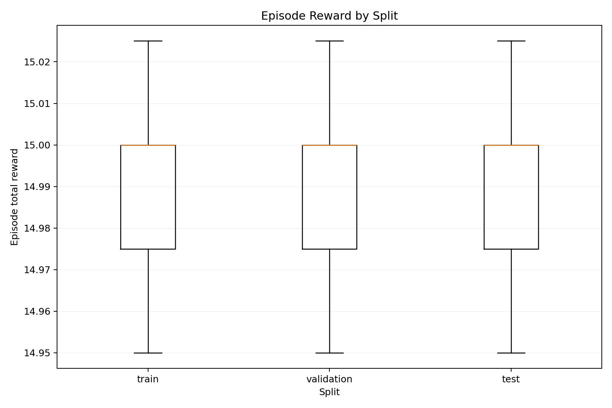
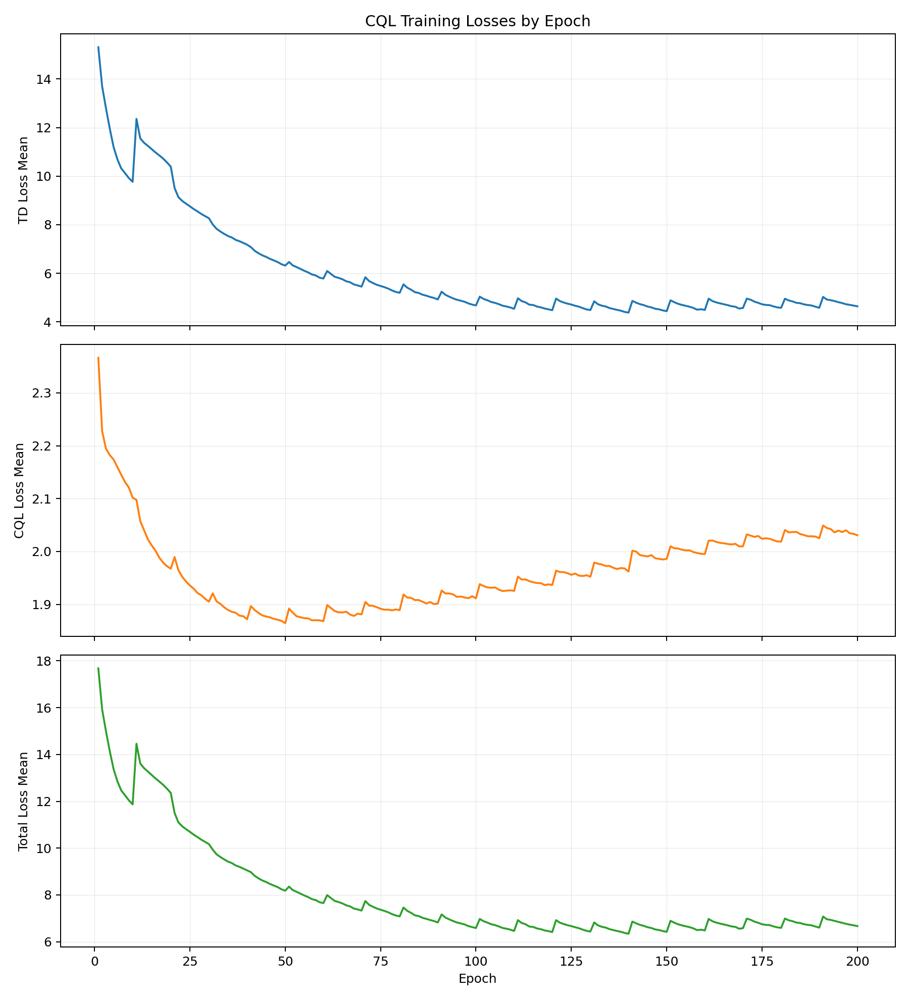
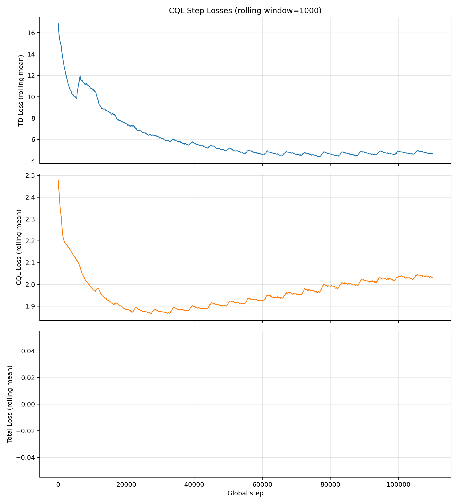
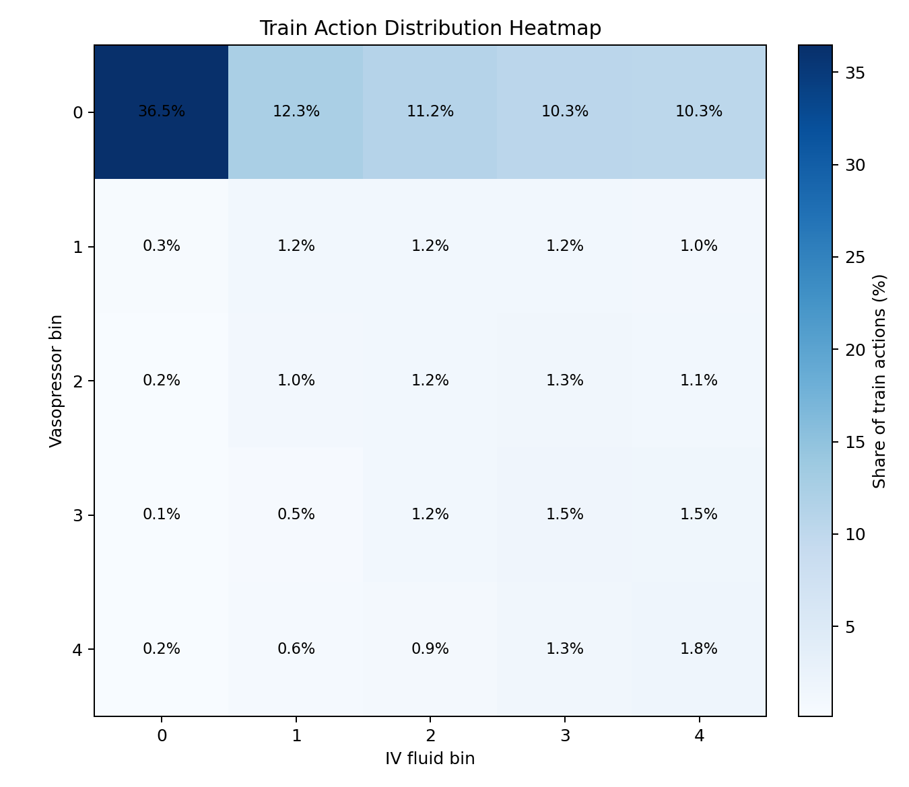

# CQL Run Report

**Run date:** 2026-03-29  
**Algorithm:** CQL  
**Status:** Completed (`200` epochs, `110000` optimizer steps)  
**Device:** Apple Silicon MPS  

## Executive Summary

Bu rapor, mevcut CQL koşusunun eğitim metriklerini, veri özeti grafiklerini ve
yorumlarını tek yerde toplar. Koşu teknik olarak başarılıdır: eğitim son epoch'a
kadar tamamlanmış, checkpoint artifaktları yazılmış ve loss eğrileri belirgin
şekilde aşağı inmiştir.

Ancak önemli ayrım şudur:

- Eğitim logları gerçek `policy rollout reward per episode` metriğini üretmiyor.
- Bu yüzden reward grafikleri, **logged offline dataset** üzerindeki episode
  reward yapısını gösteriyor.
- Model kalitesi için asıl karar metriği eğitim loss'ları ile birlikte daha sonra
  çalıştırılacak held-out OPE/evaluation katmanı olmalıdır.

## Run Configuration

| Field | Value |
|---|---|
| Config | `configs/training/cql.yaml` |
| Epoch | `200` |
| Batch size | `256` |
| Gamma | `0.99` |
| CQL alpha | `1.0` |
| Hidden sizes | `[256, 256]` |
| Train replay | `data/replay/replay_train.parquet` |
| Metrics log | `runs/cql/cql_reference_metrics.jsonl` |
| Final manifest | `checkpoints/cql/cql_epoch0200_step0110000_manifest.json` |

## Dataset Envelope

Replay metadata üzerinden görülen split boyutları:

| Split | Episodes | Transitions | State dim | Actions |
|---|---:|---:|---:|---:|
| Train | 12062 | 140635 | 62 | 25 |
| Validation | 2584 | 30539 | 62 | 25 |
| Test | 2585 | 30046 | 62 | 25 |

Toplam reward artifaktı `17231` episode kapsıyor. Buna karşın
`data/processed/episodes/episodes.parquet` içinde `17233` episode var. İki stay
reward/replay tarafına düşmemiş:

- train: `stay_id=32771340`
- validation: `stay_id=33921961`

Bu yüzden split summary ile reward/replay artifaktları arasında `2` episode farkı
görülmesi beklenir.

## Key Training Metrics

### Final epoch

| Metric | Value |
|---|---:|
| `td_loss_mean` | 4.6390 |
| `cql_loss_mean` | 2.0306 |
| `total_loss_mean` | 6.6696 |

### Best observed epochs

| Criterion | Epoch | `td_loss_mean` | `cql_loss_mean` | `total_loss_mean` |
|---|---:|---:|---:|---:|
| Lowest total loss | 140 | 4.3801 | 1.9621 | 6.3422 |
| Lowest TD loss | 140 | 4.3801 | 1.9621 | 6.3422 |
| Lowest CQL loss | 50 | 6.3168 | 1.8644 | 8.1813 |
| Final checkpoint | 200 | 4.6390 | 2.0306 | 6.6696 |

## Visuals

### 1. Raw episode reward curve

Bu grafik her episode'un ham toplam reward'unu gösterir. `x` ekseni episode
indeksidir; eğri eğitim sırasında ajan tarafından toplanan online reward değil,
offline dataset içindeki logged episode reward sırasıdır.

### 2. Rolling average reward curve

Bu versiyon `200` episode'luk rolling average uygular. Sunum ve rapor için daha
okunaklıdır.

### 3. Episode reward distribution

Reward dağılımı pozitif tarafta yoğunlaşıyor. Bunun sebebi terminal ödül yapısının
ve shaping bileşenlerinin toplam reward üstünde güçlü etkisi olmasıdır.

### 4. Reward by split

Train, validation ve test split'leri reward istatistikleri bakımından birbirine
yakın. Bu, split'ler arasında kaba reward drift'i olmadığını düşündürüyor.

### 5. Epoch-level training losses

Epoch ortalamaları incelendiğinde ilk bölümde hızlı düşüş, sonra yavaş plato
görülüyor.

### 6. Step-level smoothed losses

Global step üstünde bakıldığında eğitim stabil; patlama veya belirgin diverjans
işareti yok.

### 7. Train action heatmap

Train split aksiyon dağılımı 5x5 ayrık tedavi ızgarasında dengesiz. Bu beklenen
bir offline RL özelliği; CQL gibi konservatif yöntemler bu davranış dağılımına
yakın kalma eğilimindedir.

## Interpretation

### What looks good

- Eğitim başarıyla tamamlandı; final checkpoint ve manifest yazıldı.
- `td_loss_mean` ve `total_loss_mean` güçlü biçimde düştü.
- Step-level eğriler stabil; belirgin numerik patlama görünmüyor.
- Split bazlı reward özeti tutarlı; validation ve test reward ölçeği train ile
  aynı bantta.

### What needs caution

- Final epoch (`200`) en iyi training objective noktası değil. En düşük toplam
  loss `epoch 140` civarında.
- Mevcut checkpoint cadence yüzünden elimizde `140` checkpoint'i yok; eldeki
  kayıtlı adaylar arasında `160` checkpoint'i finalden daha iyi seçim olabilir.
- Reward eğrileri model performans eğrisi değil; offline dataset reward
  görünümüdür.
- Bu koşudan klinik kalite veya policy üstünlüğü sonucu çıkarmak için OPE yoktur.

## Episode Reward Statistics

### Overall

| Metric | Value |
|---|---:|
| Episodes | 17231 |
| Mean reward | 10.3125 |
| Median reward | 15.0000 |
| Std reward | 10.8889 |
| Min reward | -15.0500 |
| Max reward | 15.0500 |

### By split

| Split | Episodes | Mean | Median | Std | Min | Max |
|---|---:|---:|---:|---:|---:|---:|
| Train | 12062 | 10.3654 | 15.0000 | 10.8385 | -15.0500 | 15.0500 |
| Validation | 2584 | 10.1648 | 15.0000 | 11.0296 | -15.0500 | 15.0500 |
| Test | 2585 | 10.2134 | 15.0000 | 10.9839 | -15.0500 | 15.0500 |

## Recommended Next Steps

1. Aynı artifact envelope ile BCQ ve IQL koşularını tamamla.
2. Eğitim objective açısından `epoch 160` checkpoint'ini final model ile ayrı
   değerlendirmeye al.
3. Held-out OPE katmanını çalıştır ve gerçek kıyas tablolarını ekle.
4. Rapor sunumunda reward eğrilerini açık biçimde `logged offline episode reward`
   olarak etiketle.

## Artifact Index

| Artifact | Path |
|---|---|
| Metrics JSONL | `runs/cql/cql_reference_metrics.jsonl` |
| Final checkpoint manifest | `checkpoints/cql/cql_epoch0200_step0110000_manifest.json` |
| Summary JSON | `docs/assets/cql-run/summary.json` |
| Raw reward curve | `docs/assets/cql-run/episode_reward_raw_curve.png` |
| Rolling reward curve | `docs/assets/cql-run/episode_reward_rolling_curve.png` |
| Reward distribution | `docs/assets/cql-run/episode_reward_distribution.png` |
| Reward split boxplot | `docs/assets/cql-run/episode_reward_by_split_boxplot.png` |
| Epoch loss curves | `docs/assets/cql-run/cql_epoch_losses.png` |
| Step loss curves | `docs/assets/cql-run/cql_step_losses_smoothed.png` |
| Train action heatmap | `docs/assets/cql-run/train_action_heatmap.png` |
